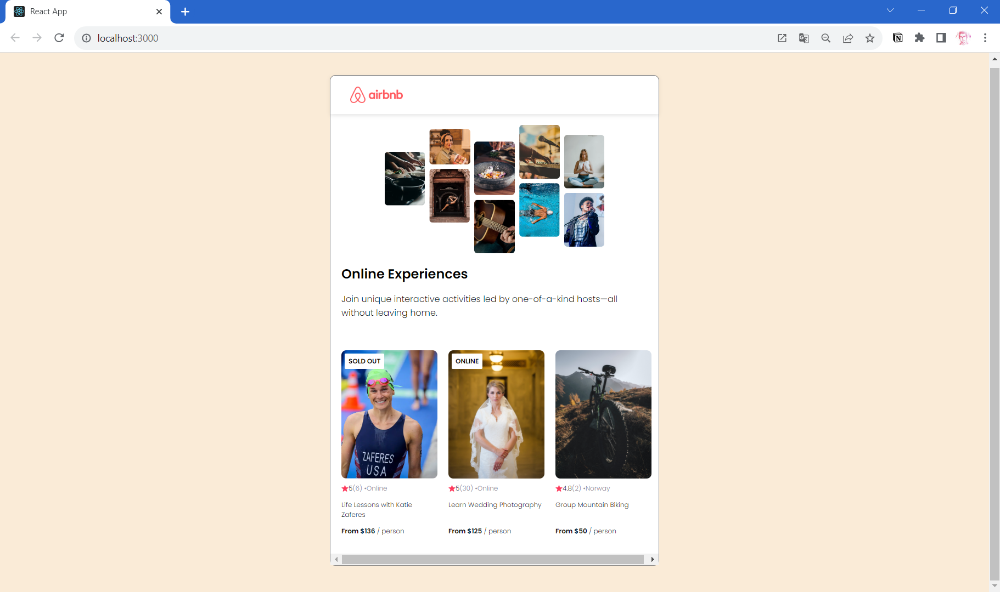

# Airbnb Experience React App



This project is an Airbnb Experience React app developed to showcase my skills while learning from Scrimba. The app displays various experiences with details such as ratings, review counts, locations, and prices.


## Features

- Dynamic rendering of experiences with badges for sold-out and online events.
- Displaying experience details such as ratings, review counts, locations, and prices.

## Technologies Used

- React: A JavaScript library for building user interfaces.
- HTML: The structure of the web app.
- CSS: Styling and layout for the app.
- Git: Version control to track changes.

## Getting Started

To get a copy of this project up and running on your local machine, follow these steps:

1. Clone the repository:

```
git clone https://github.com/your-username/airbnb-experience-app.git
```

2. Install dependencies:

```
cd airbnb-experience-app
npm install
```

3. Start the development server:

```
npm start
```

4. Open your web browser and navigate to http://localhost:3000 to view the Airbnb Experience React app.

## Contributing

Contributions are welcome! If you find any issues or have ideas to improve the project, feel free to open an issue or submit a pull request.


## Acknowledgments

- This project was built during my React course on Scrimba, and I want to thank the Scrimba team for providing a great learning platform.
- Special thanks to Airbnb for inspiring the project and providing the idea for showcasing Airbnb experiences.

---

This README template provides an overview of your Airbnb Experience React app project, explains how to run it locally, and gives credit to any external resources or inspirations. Customize the README with additional details or sections as needed to best represent your project. Happy coding!
